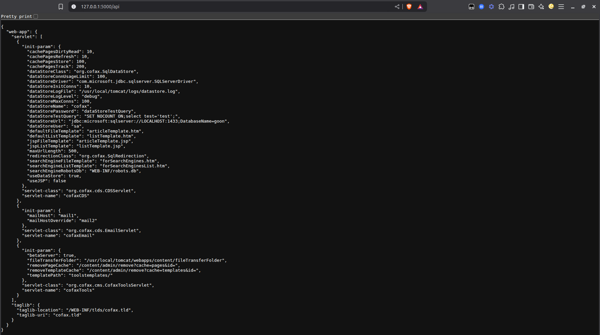
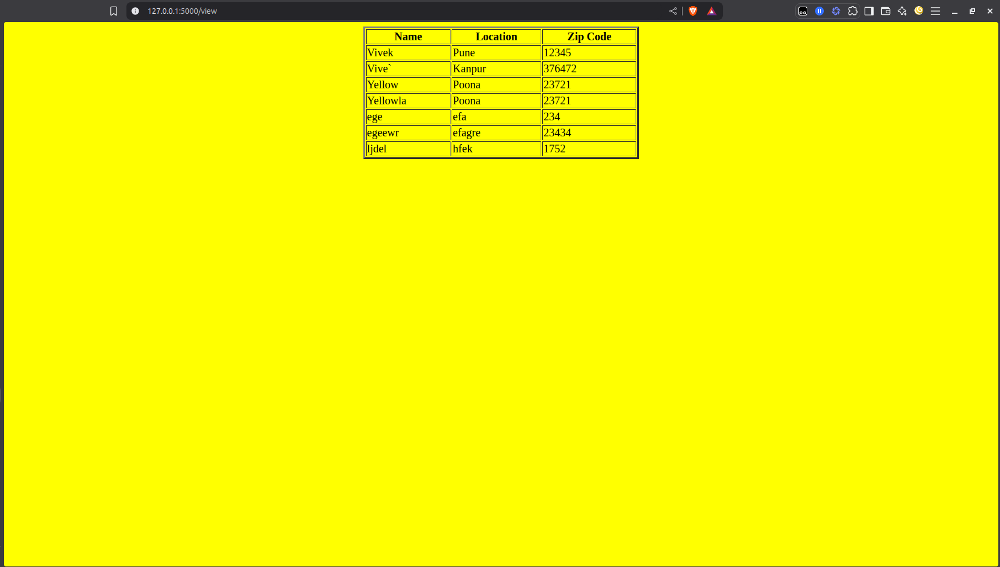
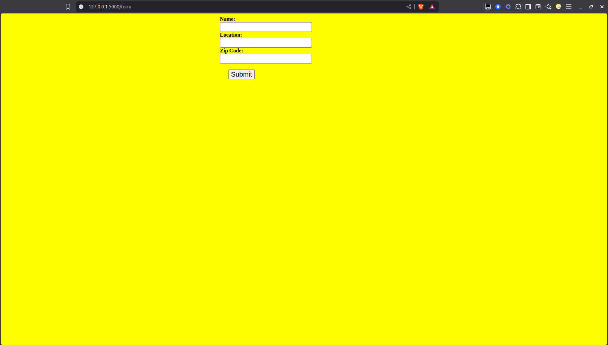
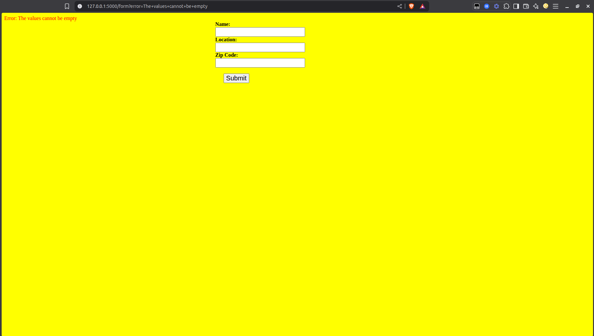
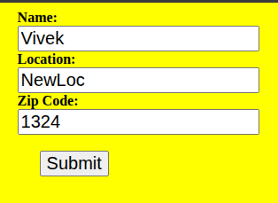
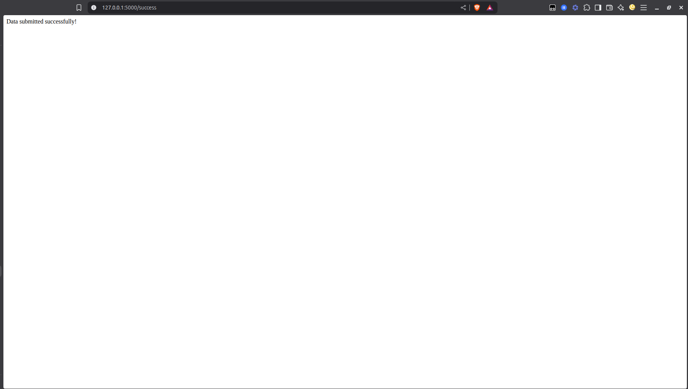

# TASK-1: Flask outputs the JSON file

The program contains a Flask module code to route a /api request which reads a json file present in the same directory and show the content of it in Browser

#### Sample Result


Execution command:
```shell
python "flask-req.py"
```

After execution open the link: http://127.0.0.1:5000/api (or any other port that gets shown in the terminal) to get the result

--------------------------------------------
# TASK-2: Flask with MongoDB Connection

The program contains Flask framework to run HTML pages for viewing content of MongoDB Atlas having table that also allows submitting entries to it

Execution command:
```shell
python "mongodb-req.py"
```

- After execution open the link: http://127.0.0.1:5000/ (or any other port that gets shown in the terminal) to get the API to submit entries.
- The user can enter the entries, confirming the details are in proper format and not empty, otherwise, an error will get raised on the same page
- To view the DB entries, user can change the url to http://127.0.0.1:5000/view.

### Sample Image 1: View Data



### Sample Image 2: Form



### Sample Image 3: Form with Error



### Sample Image 4: Filled Detail



### Sample Image 5: After Data submission


